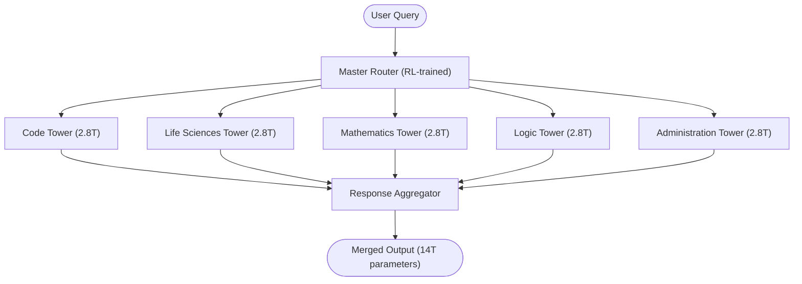
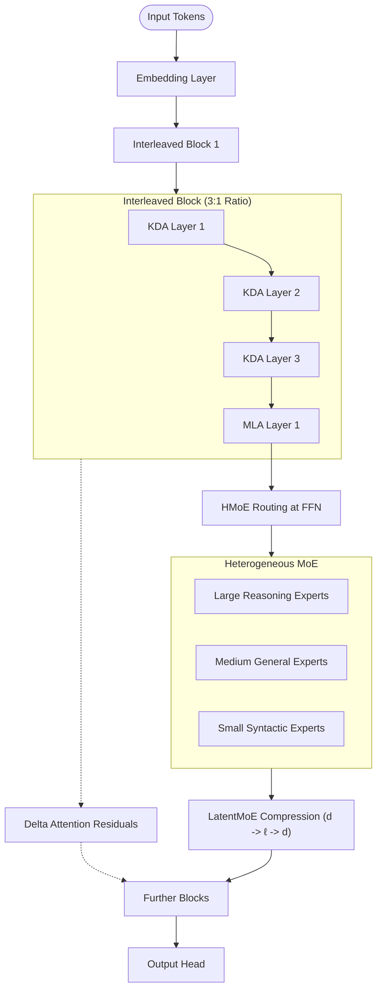
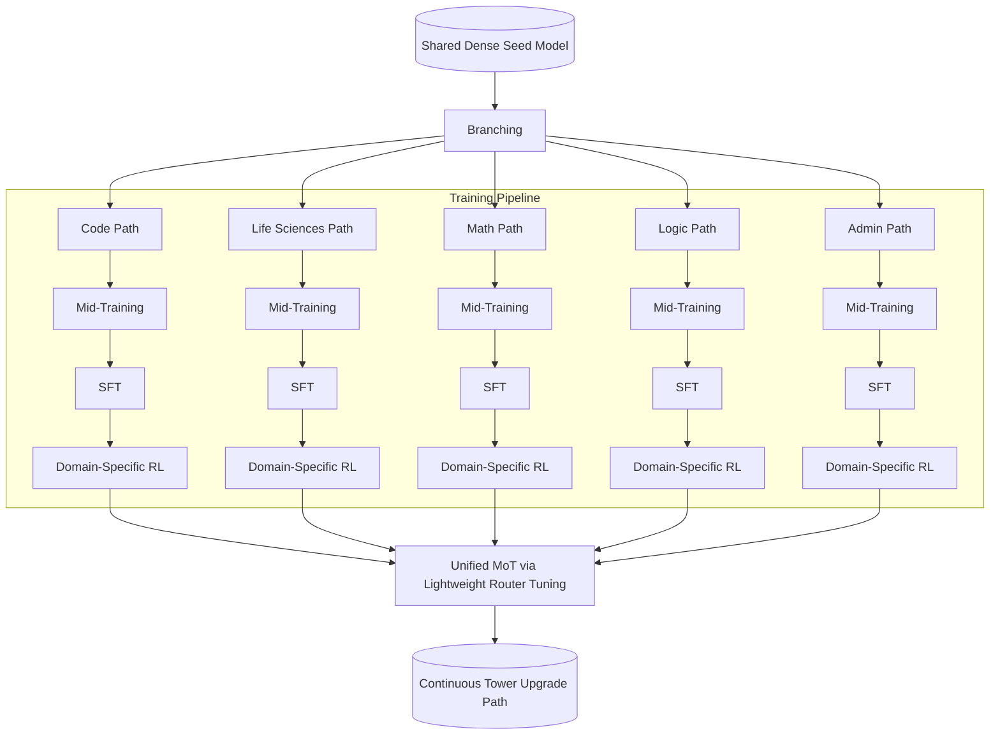
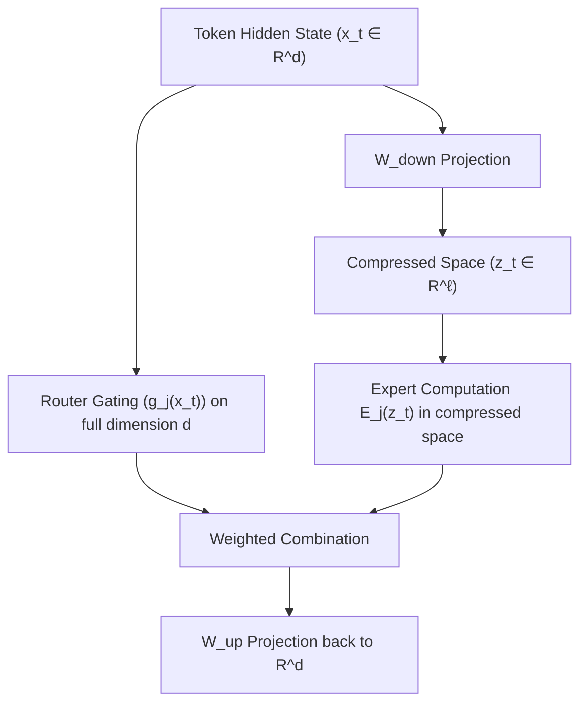
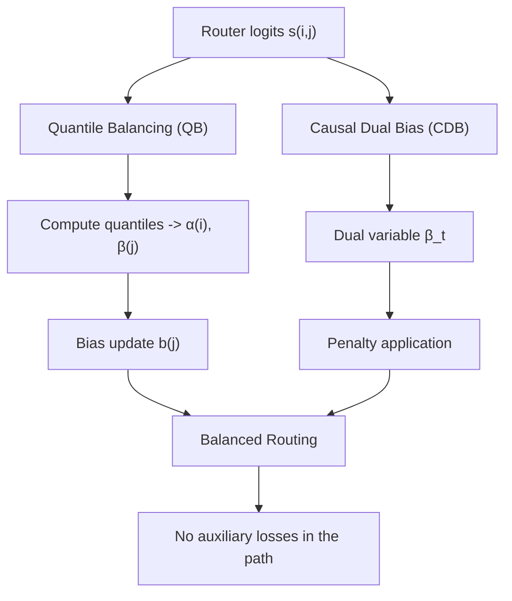
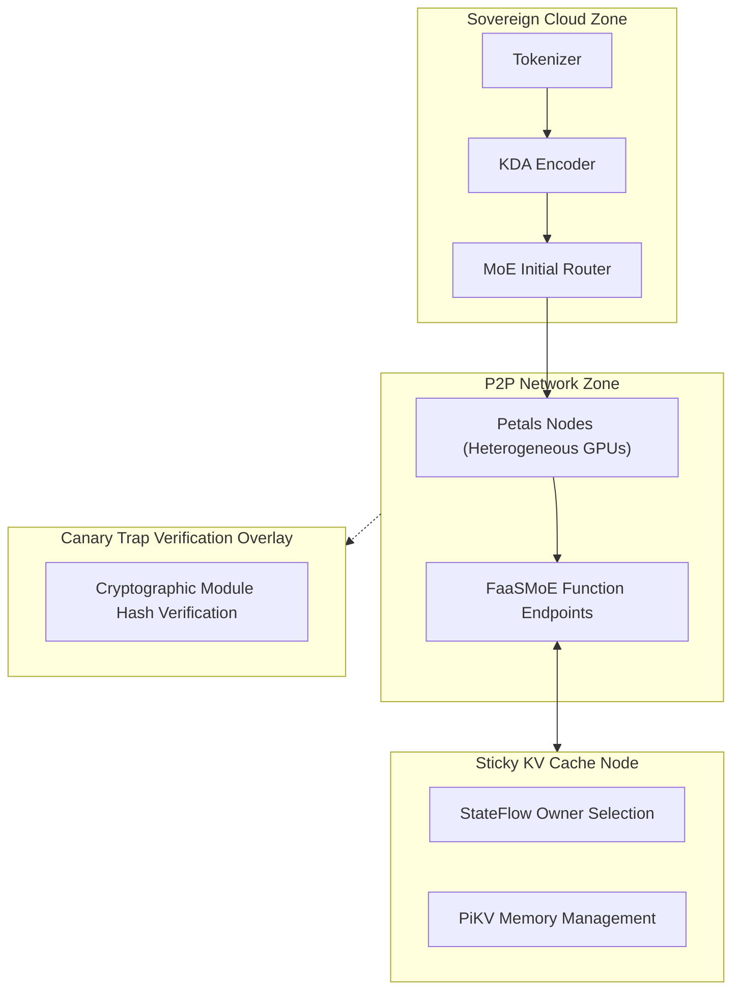
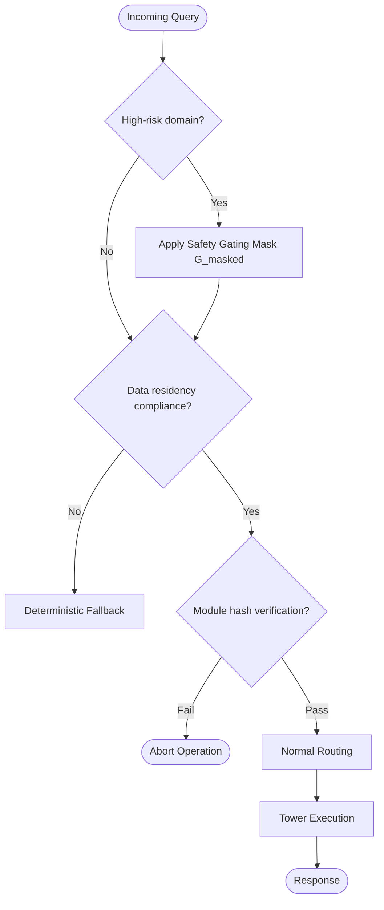
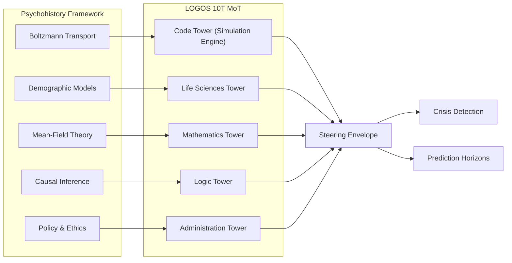

# LOGOS Architecture — Visual Reference

## 1. System Overview: 5×2.8T Mixture-of-Towers

## 2. Single Tower Internal Architecture

## 3. Branch-Adapt-Route (BAR) Training Pipeline

## 4. LatentMoE Compression Flow

## 5. Quantile Balancing + Causal Dual Bias

## 6. Distributed Inference Topology

## 7. Sovereign AI Compliance Flow

## 8. Psychohistory Integration Map

## 9. Verification Phase Dependencies

```mermaid
gantt
    title Verification Phase Dependencies
    dateFormat X
    axisFormat %s
    
    section Independent
    Phase 0: Micro-benchmarks    :a1, 0, 10d
    
    section Dependent
    Phase 1: Tower Prototype     :a2, after a1, 15d
    Phase 2: MoT Integration     :a3, after a2, 20d
    Phase 3: P2P Distributed     :a4, after a3, 20d
    Phase 4: Psychohistory Integration :a5, after a3, 25d
```

